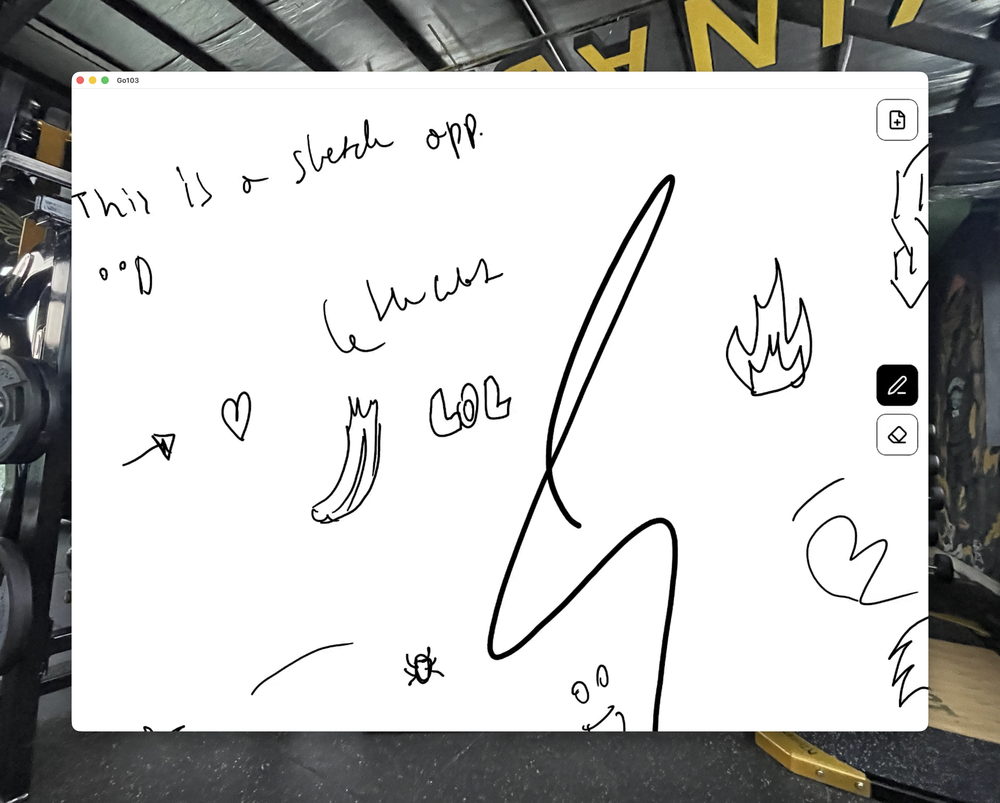

# Sketchbook

<p align="center">
  
</p>

A fast, minimal sketching app for BOOX e-ink tablets.

## Features

- Native low-latency Fountain pen preview
- Native soft eraser preview
- Two-finger pan and pinch-to-zoom canvas
- Two-finger double-tap to reset zoom
- Persistent sketches and canvas position
- Immersive edge-to-edge canvas

## Build and install

Requires a BOOX Android e-ink tablet with pen support and Android 11 or newer.

```sh
./gradlew :app:assembleDebug
adb install -r app/build/outputs/apk/debug/app-debug.apk
```

## How it works

The BOOX firmware owns the live stylus preview through `TouchHelper`, while the app commits each
completed stroke into its own bitmap-backed document. This keeps drawing responsive while making
the sketch safe to pan, zoom, erase, and restore after an app restart.

## License

Apache-2.0. BOOX's SDK remains subject to BOOX's own terms.
